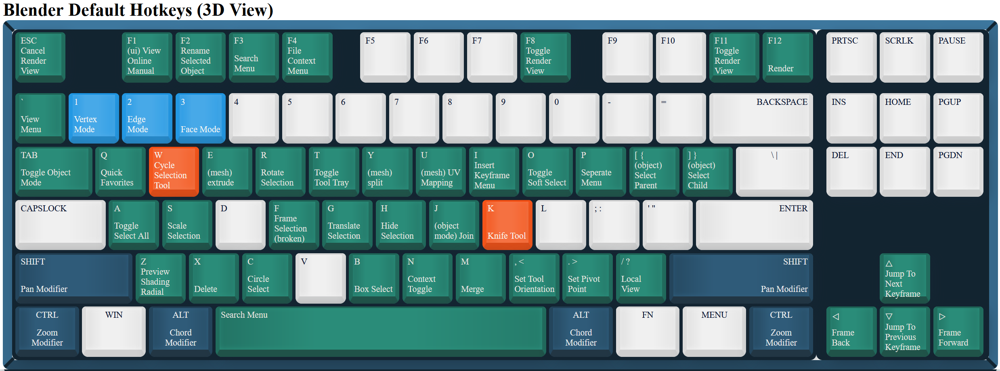
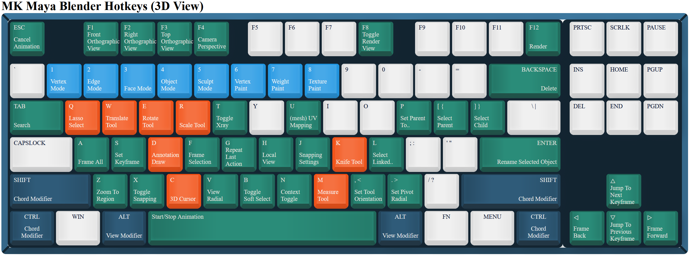

### Hello!
When I started trying to learn Blender, I found the industry standard hotkeys to be lacking for the terminally Maya brained. Hopefully these bindings make the transition a little easier for others.

#### Install Instructions
In Blender's top bar, go to `Edit -> Preferences -> Keymap` and hit the 'Import...' button, just select the `.py` file here.

### Hotkeys In This Plugin Vs. Blender Defaults

Visual diagrams created using [Keyboard Shortcut Map Maker](https://archie-adams.github.io/keyboard-shortcut-map-maker/) by Archie Adams.
